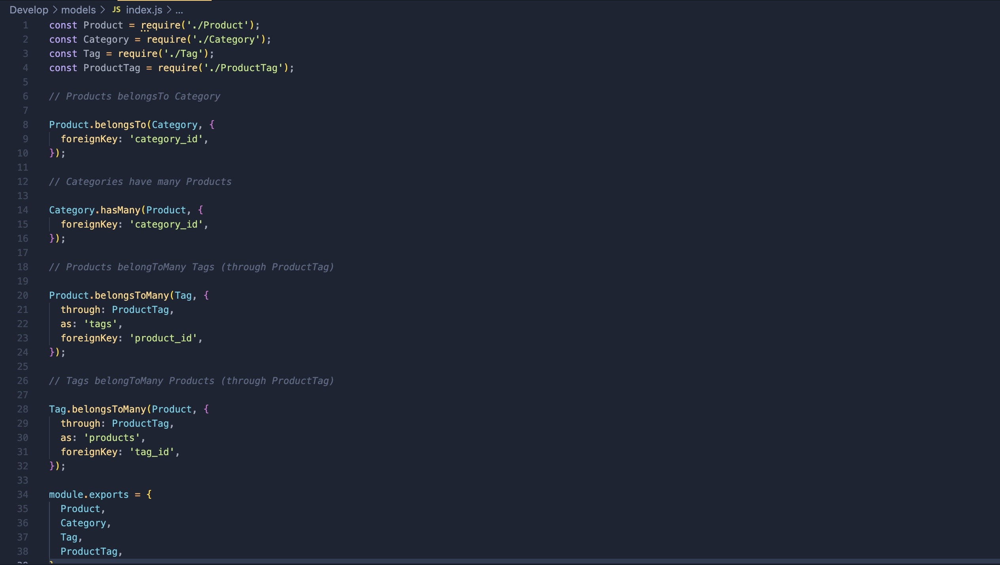
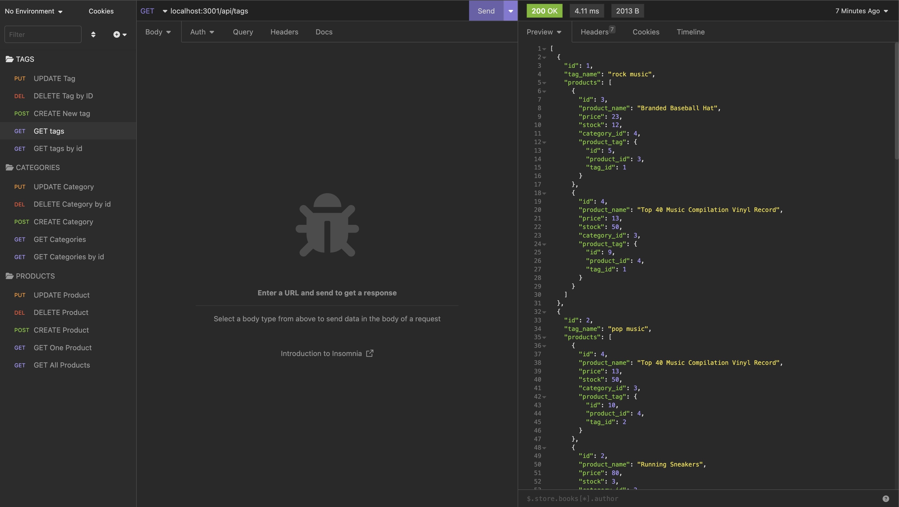

# Complete E-Comm Back-End

# Description

This project was built as the back-end for an ecommerce site. It has the Tags, Products, and the Categories, and the ability to post, update, and delete information within the database. The database' name is ecommerce_db and I built an api to match all the data together. I also built seed files to seed the database with the information needed for the back end.

# Table of Contents
* [Installation](#installation)
* [Usage](#usage)
* [Credits](#credits)

# Installation

To install this project, clone the repository from GitHub and open it in your own IDE. Within your terminal, sign in to your mySQL account using mysql -p and run "USE ecommerce_db;" and then "source schema.sql". After you are using the database, in your terminal type seeds/index.js and this will seed the database. Once this is done, run npm install to install the dependencies.

# Video

# Usage

In your IDE terminal, type npm start. This will start the server, and in your web broswer or insomnia type in "localhost:3001/api and search through the material.

Screenshots of the code

# Credits

This application was built from scratch by Kyle Parks.